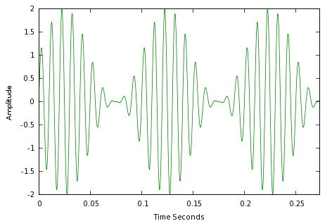
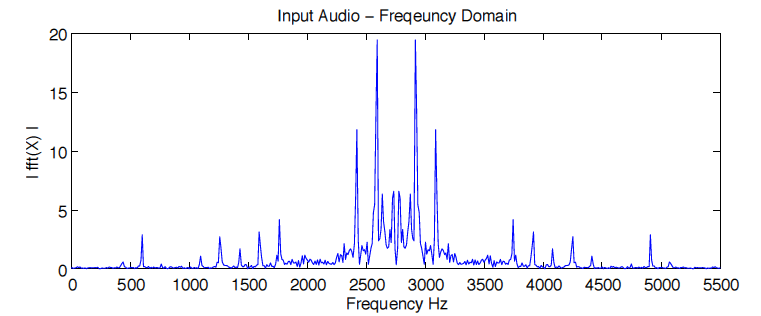
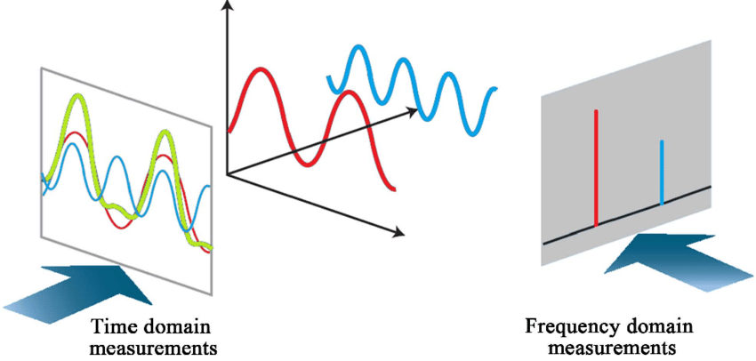
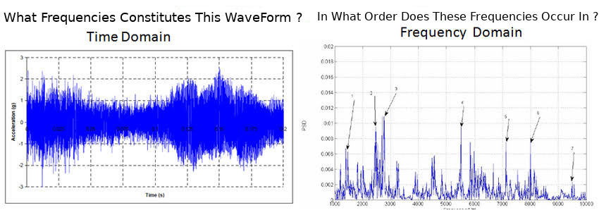
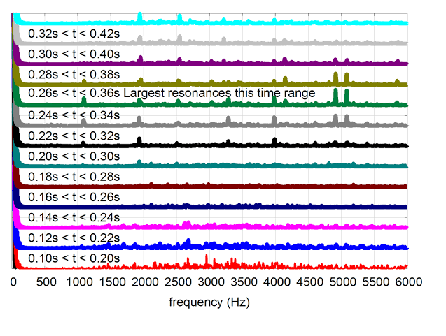
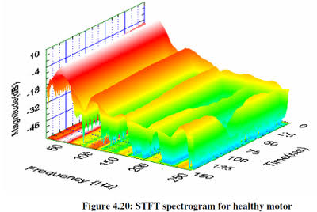
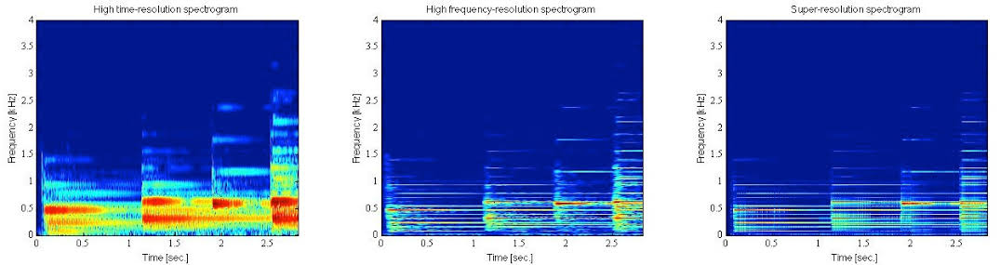

# Review-of-DCTTS
Review of Text to Speech using Deep Convolution (with code)

This is a review of the paper "Efficiently Trainable Text-to-Speech System Based on Deep Convolutional  Networks with Guided Attention" https://arxiv.org/abs/1710.08969

# Prerequisite Knowledge

To understand this notebook properly, you must have some knowledge about how sounds are dealt with, in data science and the various operations that are performed to convert a Waveform to a representaion suitable for analysis.
Some Basic Concepts Are Mentioned Below :-

## Fourier Transform (FT)

Before we start with what Fourier Trasnform is, let us first understand some terminologies that we will need to know about to understand it in a better way

### 1. Time-Domain Representation or a WaveForm
A WaveForm or an audio signal is the raw representation of a sound wave as a function of <b>Time</b> and it's <b>Intensities</b>.
This representaion is also known as the <b>Time-Domain Representation</b> or the <b>Time-Amplitude Representation</b> 

### 2. Frequency-Domain Representation
A Frequency-Domain Representation refers to the analysis of mathematical functions or signals with respect to frequency, rather than time.
This representaion is also known as the <b>Frequency-Amplitude Representation</b> or the <b>Amplitude-Frequency Representation</b>. 

Put simply, a time-domain graph shows how a signal changes over time, whereas a frequency-domain graph shows how much of the signal lies within each given frequency band over a range of frequencies.

#### Now how does this all relate to the Fourier Trasnform?

<b>The Fourier transform</b> (FT) decomposes a function of time (a signal) into its constituent frequencies. This is similar to the way a musical chord can be expressed in terms of the volumes and frequencies of its constituent notes. The term Fourier transform refers to both the frequency domain representation and the mathematical operation that associates the frequency domain representation to a function of time. 
Essentially A Fourier Trasnform when applied on a Signal Represented in the Time-Domain gets converted to the Frequency-Domain.

#### Now the question arieses, why do we need to convert the signal to a Frequency-Domain representation ?

Time domain signals, just provide the information regarding the value of a function/signal at any given instance. They do not convey the information as to the rate at which the signal is varying. Thus the need arises to represent the signal in another domain, describing the rate at which they vary, or the frequency.

But we need both the aspects of Time-Domain as well as the Frequency-Domain to understand better the properties the WaveForm that we have.
The Time-Domain Representation gives us the times at which the signal was perceived while the Frequency-Domain Representation tells us about the Frequency distribution of the WaveForm.

#### This Problems brings us to our next Method

## Short-Time Fourier Transform (STFT)

The short-time Fourier transform (STFT), is a Fourier-related transform used to determine the sinusoidal frequency and phase content of local sections of a signal as it changes over time. In practice, the procedure for computing STFTs is to divide a longer time signal into shorter segments of equal length and then compute the Fourier transform separately on each shorter segment. This reveals the Fourier spectrum on each shorter segment. One then usually plots the changing spectra as a function of time. 

## Spectograms

The STFT is one of the most frequently used tools in speech analysis and processing. It describes the evolution of frequency components over time. Like the spectrum itself, one of the benefits of STFTs is that its parameters have a physical and intuitive interpretation.

A further parallel with a spectrum is that the output of the STFT is complex-valued, though where the spectrum is a vector, the STFT output is a matrix. As a consequence, we cannot directly visualize the complex-valued output. Instead, STFTs are usually visualized using their log-spectra,  $20log10(X(h,k))$. Such 2 dimensional log-spectra can then be visualized with a heat-map known as a spectrogram.

#### 3D- Visualization Of A Spectogram

#### 2D- Representation With Color-Coded Amplitude

## MEL SCALE

Let’s forget for a moment about all these lovely visualization and talk math. The Mel Scale, mathematically speaking, is the result of some non-linear transformation of the frequency scale. This Mel Scale is constructed such that sounds of equal distance from each other on the Mel Scale, also “sound” to humans as they are equal in distance from one another.
In contrast to Hz scale, where the difference between 500 and 1000 Hz is obvious, whereas the difference between 7500 and 8000 Hz is barely noticeable.

## MEL Spectogram

We know now what is a Spectrogram, and also what is the Mel Scale, so the Mel Spectrogram, is, rather surprisingly, a Spectrogram with the Mel Scale as its y axis.

## Download Links

LJSpeech dataset : **[Here](https://keithito.com/LJ-Speech-Dataset/)**
The dataset will be downloaded when you run the notebook

# How Does It Work ?

The DC-TTS Model consits of 2 main Model:

## Text2Mel Model :

We train this model to synthesize a coarse MEL Spectogram from a given Text.
This model consists of $4$ sub-modules

### Text Encoder

Encodes the input sentence $L$ = [c1,c2,c3.....cn] where c1 , c2 , c3 .... cn are characters, into two Key and Value Matrices <b>K</b> and <b>V</b>

$(K,V) = TextEncoder(L)$

### Audio Encoder

Encodes the coarse MEL-Spectogram of previously spoken speech, whose length is $T$, into a matrix $Q$.
Takes in as input, the target audio Spectogram and outputs a queries matrix $Q$ of size $dxT$ , where $T$ is length of the audio clip.

$Q$ $=$ $AudioEncoder$$($S1:F,1:T$)$

### Attention

An Attention Matrix $A$ evaluates how strongly the nth character cn and tth frame $S$1:F,T are related

$A = softmax($KT${Q/d^{1/2}})$

Ant ~ 1 implies that the modules is looking at nth Character cn at time frame t and it will look at cn or cn+1 characters around them, at the subsequent time frame t+1.

$R = Attention(Q,K,V) = V.A $

### Audio Decoder

The resultant $R$ is contatenated with the encoded audio $Q$ as $R' = [R,Q]$.
Then $R'$ is decoded by the Audio Decoder module to synthesize a coarse MEL-Spectogram.

$Y$1:F,2:T+1 $= AudioDecoder(R')$

The result $Y$1:F,2:T+1 is compared with the temporally-shifted truth $S$1:F,2:T+1 by a loss function and error is back propogaed to the network parameters.

## Spectogram Super-Resolution Model :

Super resolution is the process of upscaling and or improving the details within an image. Often a low resolution image is taken as an input and the same image is upscaled to a higher resolution, which is the output. The details in the high resolution output are filled in where the details are essentially unknown.

Super resolution is essentially what you see in films and series like CSI where someone zooms into an image and it improves in quality and the details just appear.

Similarly our SSR model does the same but for audio signals or spectograms.
This model converts the coarse MEL-Spectogram generated by the Text2Mel Model to A Super-Resolution Spectogram.

